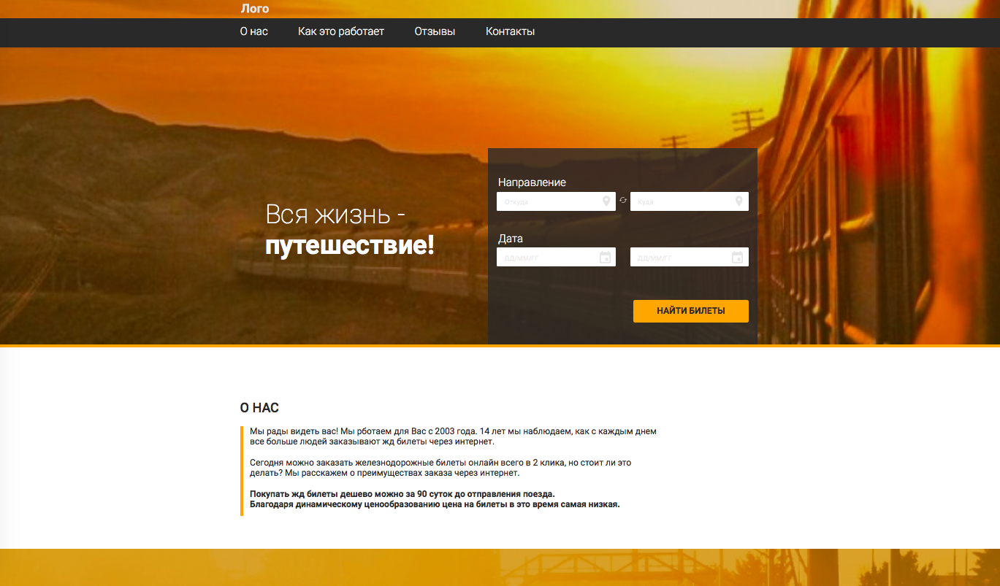

# TrainTickets Service.

## Дипломный проект по профессии Frontend-разработчик (Нетология).

Ссылка на опубликованный проект на [github-pages](https://queenarizona.github.io/TrainTickets-Service/).

Это проект сервиса покупки ж/д билетов на различные направления. Главная задача - создание SPA на React, сверстанного по [макетам в Figma](https://www.figma.com/file/7981GjEsjSpBUKolk4xFoT/Заказ-билетов?node-id=0%3A1), в котором в качестве API используется внешний сервер.

В данном проекте использовалась библиотека React, а так же Redux и Redux Thunk для хранения состояния и побочных эффектов.



## Выполненные задачи:

- Реализована вёрстка всех основных элементов по макетам из Figma, за исключением лоадеров и всплывающих подсказок.
- При вёрстке элементов соблюдены правила именования по БЭМ.
- Реализована корректная навигация по приложению с помощью React Router'а.
- Сделано визуальное отображение прогресса в процессе создания пользователем заказа.
- Разработаны все [элементы](https://github.com/netology-code/fe-2-diplom/) проекта, необходимые для работы приложения.
- Написана логика для автозаполнения при вводе названия направления в форму поиска.
- Реализован фильтр билетов по классу вагона, наличию wifi, стоимости билетов и времени отправления и прибытия.
- Готова функциональность для просмотра билетов по выбранному направлению, списка последних билетов, выбора количества пассажиров, класса вагона, мест в вагоне и т.д. Сделаны формы для введения данных пассажиров и информации об оплате
- Настроено необходимое API для работы с запросами на внешний сервер (загрузка направления, вагонов, мест, подписка на обновления).
- Реализовано хранение состояния приложения с помощью Redux.
- Приложение развернуто на github-pages.

Из-за недоработки внешнего API отсутствует возможность реализовать всю функциональность работы приложения, например, выбор дат, выбор поездов туда-обратно и связанные с этим решения, в том числе по обработке данных для отправки готового заказа на сервер. Также незавершено отображение загрузки и сообщений об ошибках.

Для установки зависимостей и запуска проекта локально используются команды:

```sh
$ npm install
$ npm run start
```
